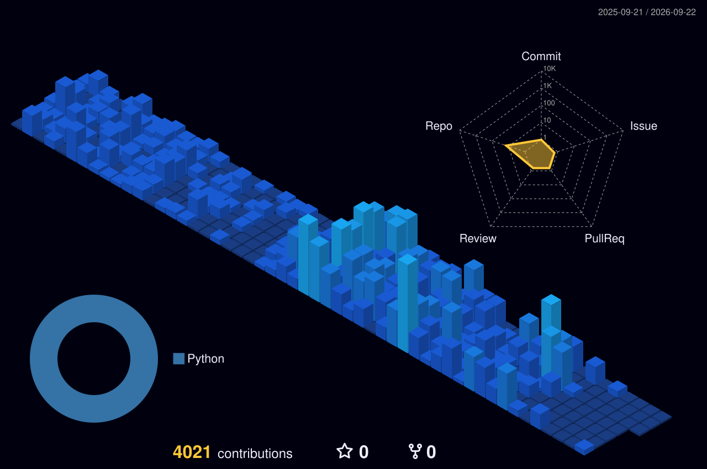

<!-- This file is the template. The published README.md is built by build_profile.py.
     Edit this file to change the static structure. Sections between START/END markers
     are regenerated on every workflow run — do not hand-edit those in README.md. -->

I write code, run a homelab, and ship side projects across web apps, AI tooling, infrastructure automation, embedded hardware, and tabletop game tech. Most of my work lives in private repos, but the breadth is real.

### What I build

**AI and agents.** I've shipped a Slack-native agent that helps a marketing team turn quick prompts into publishable LinkedIn posts and on-brand graphics, and a dual-mode RAG chatbot for an arts and crafts business — a public widget for customers and a password-gated internal mode for staff. I write Model Context Protocol servers (the one for Foundry VTT lets language models query and act on a live tabletop game state). I also run a homegrown multi-agent video production pipeline and an M365 admin CLI built for compromised-user triage.

**Tabletop game tech.** I maintain Vitas Nova, a homebrew D&D 5e campaign wiki I publish out of Obsidian through Quartz onto Cloudflare Pages. I run a Foundry VTT server for the campaign and built a session-recording and live-transcription pipeline so we can replay or annotate sessions afterward. There's also a 5e character sheet editor I wrote that produces print-ready PDFs.

**Dev tooling, open-sourced.** Small pieces pulled from my daily AI workflow:

- [`claude-statusline`](https://github.com/Gluthoric/claude-statusline) — compact custom status line for Claude Code.
- [`claude-agents-kit`](https://github.com/Gluthoric/claude-agents-kit) — seven opinionated subagent definitions for code review, debugging, security audits, architecture review, UX review, database analysis, and orchestration.

**Hardware and systems.** My home network runs a real security stack: **Wazuh** SIEM for log aggregation and threat detection, **ntopng** for flow analysis, **Pi-hole** for DNS filtering and ad-blocking, a **UniFi** controller managing the wired and wireless fabric, and everything logging into a central indexer. A **Matter-backed Home Assistant** deployment handles physical-world automation on the same network. On the embedded side I write **ESP32 firmware** (soil sensors, Wi-Fi scanners), design printable parts in **OpenSCAD**, and occasionally tinker with Hyundai/KIA Gen5W navigation firmware when I want a vehicle to do something the manufacturer didn't intend.

**Behind all of it,** my Obsidian vault is structured as a shared knowledge base where Claude, Gemini, and Codex each get their own scratchpads, with a memory layer that persists across sessions.

### Homelab

Four bare-metal Ubuntu machines, all meshed over Tailscale:

- a Ryzen 9 9950X / RTX 5090 desktop as the primary workstation,
- a ThinkPad P14s Gen 5 for portable work and game nights,
- a production application server running FastAPI services behind Cloudflare tunnels, backed by Postgres 17 and a local Ollama instance for offline inference,
- a home services box running Pi-hole, UniFi, ntopng, Wazuh, Home Assistant, and a Matter server.

systemd-native, no Docker unless there's a real reason to use it.

### Stack I reach for

For API services I'm on **Python 3.13 + FastAPI + uvicorn** — async by default, Pydantic for typed request/response, OpenAPI generation comes free. Database is **Postgres 17**; `jsonb` and `ltree` cover most of what people reach for Mongo or graph databases for, and logical replication handles cross-host sync without dragging in a CDC tool. Frontend when I need one is **React 19** with Vite — server components have made the data-flow story noticeably cleaner than the old SSR dance.

AI work goes through the **Anthropic and OpenAI APIs** directly, no LangChain abstraction in the middle. **Ollama** on a local GPU when latency or cost matters more than capability. I write **Model Context Protocol** servers when I want to give an agent real tools instead of rebuilding function-calling from scratch each time. Slack-resident agents run on **slack-bolt** in socket mode — no public ingress required, the bot connects out.

Hosts are **bare-metal Ubuntu** managed by **systemd**. Services are units, logs come out of `journalctl` and stay there, no Docker tax unless something genuinely needs the isolation. **Tailscale** carries all internal traffic (mesh WireGuard with ACLs, no VLAN config to maintain). Secrets live in **Bitwarden Secrets Manager** and ship to hosts via a small `bws-link` script — never `.env` files committed to repos.

Notes and AI scratchpads live in **Obsidian**, synced across machines with git + rsync. Each assistant (Claude, Gemini, Codex) gets its own scratchpad plus a shared memory layer that persists across sessions, so handoffs between them are cheap.

### Activity

<!-- START:ACTIVITY -->
<!-- END:ACTIVITY -->

### Languages I work in most

<!-- START:LANGUAGES -->
<!-- END:LANGUAGES -->

### Recently active public repos

<!-- START:RECENT_PUBLIC -->
<!-- END:RECENT_PUBLIC -->

### Contribution graph

### Reach me

Open to talking about the work. The fastest path is via the projects above or a GitHub issue on one of the open-source repos.

---

<!-- START:UPDATED --><!-- END:UPDATED -->
